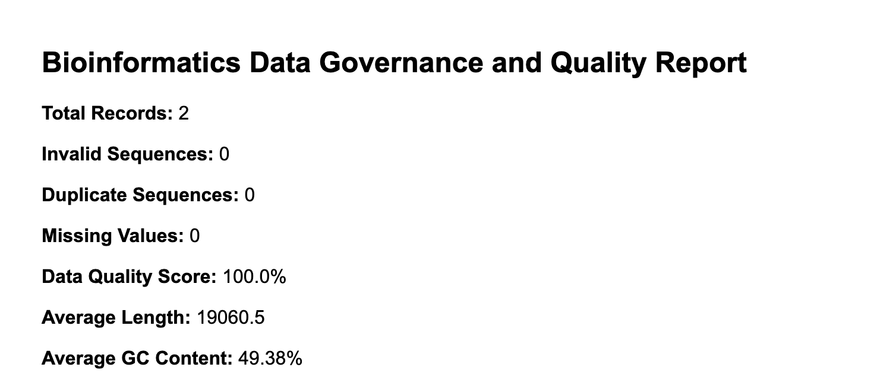

# Sequence Analytics System  

This project implements a complete data governance pipeline for genomic datasets.  
It validates DNA and mRNA sequences, evaluates data integrity, and stores automated quality metrics in a local SQLite database.

The goal is to ensure that bioinformatics datasets are accurate, complete, and reproducible through automated validation and reporting.

---

## Overview

The project reads and validates genomic sequences (FASTA or CSV format), identifies anomalies, and calculates key statistics such as GC content and sequence length.  
It then generates an HTML summary report and uploads it to a secure Google Cloud Storage bucket.

---

## Objectives

- Validate real genomic sequence data obtained from NCBI (e.g., the **TP53** tumor suppressor gene).  
- Detect invalid or duplicate DNA sequences.  
- Calculate average GC content, sequence length, and overall data quality score.  
- Automate HTML report generation and cloud upload using Google Cloud Storage.  
- Maintain a historical log of all validation runs in SQLite for reproducibility.

---

## Tools and Skills

| Tool | Purpose |
|------|----------|
| Python (pandas, biopython) | Sequence validation and analysis |
| SQLite | Local database for versioned logging |
| Google Cloud Storage | Secure cloud storage and governance |
| HTML / JSON | Reporting and structured data logging |
| Git / GitHub | Version control and documentation |

---

## Repository Contents

| File | Description |
|------|--------------|
| `src/fasta_to_csv.py` | Converts FASTA sequences into structured CSV data |
| `src/validator_step1.py` | Performs initial data validation and missing value checks |
| `src/validator_step2.py` | Performs DNA sequence validation and scoring |
| `src/generate_report.py` | Generates the HTML report with metrics |
| `src/view_logs.py` | Displays previous validation runs and quality scores |
| `reports/data_quality_report.html` | Example output from the TP53 dataset analysis |
| `governance.db` | Local SQLite database for tracking validation runs |
| `.gitignore` | Ensures sensitive keys (e.g., `gcp_key.json`) are excluded from commits |

---

## Example Output

| Metric | Result |
|--------|---------|
| Total Records | 2 |
| Invalid Sequences | 0 |
| Duplicates | 0 |
| Missing Values | 0 |
| Data Quality Score | 100% |
| Average Sequence Length | 19,060 bp |
| Average GC Content | 49.38% |

---

## Author

Created by **Khushi Patel**

